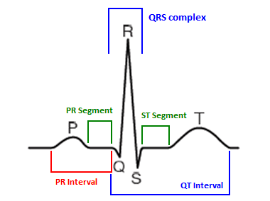

# Exploratory Data Analysis (EDA) for LTAF Database

In this study, we performed Exploratory Data Analysis (EDA) on the LTAF database to gain insights and understand the data better. EDA involves a comprehensive examination of the dataset to discover patterns, detect anomalies, and identify relationships.

## Dataset Overview

- The LTAF database consists of **84 records**.
- Each record contains three file types: **.hea**, **.atr**, and **.dat**.
- The [wfdb](https://wfdb.readthedocs.io/) Python library is used to read and process these files.

## Segmentation Technique

- We applied a segmentation technique with a **30-second interval**.
- Segmentation involves dividing the signals into consecutive 30-second segments.
- This approach allows us to analyze the data in smaller intervals, capturing specific patterns and events.

## Analysis and Results

- We examined how the signals are distributed and the changes after segmentation.
- The findings are presented in the [Results](results.md) section of this repository.

By conducting EDA and applying a 30-second segmentation interval, we gained valuable insights into the LTAF database. This approach allows us to explore temporal dynamics and better understand the underlying patterns within the physiological waveform data.

Feel free to explore the repository for detailed analysis and visualizations of the LTAF database.

